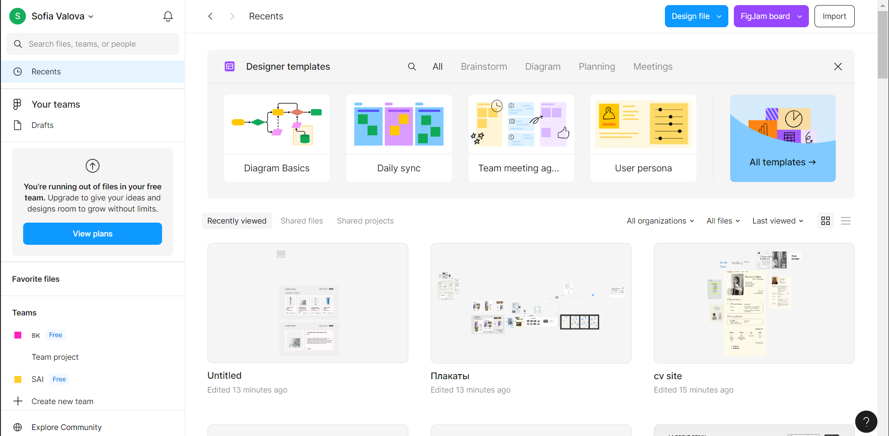
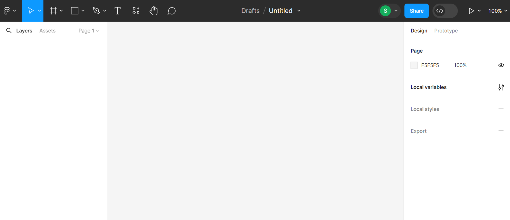
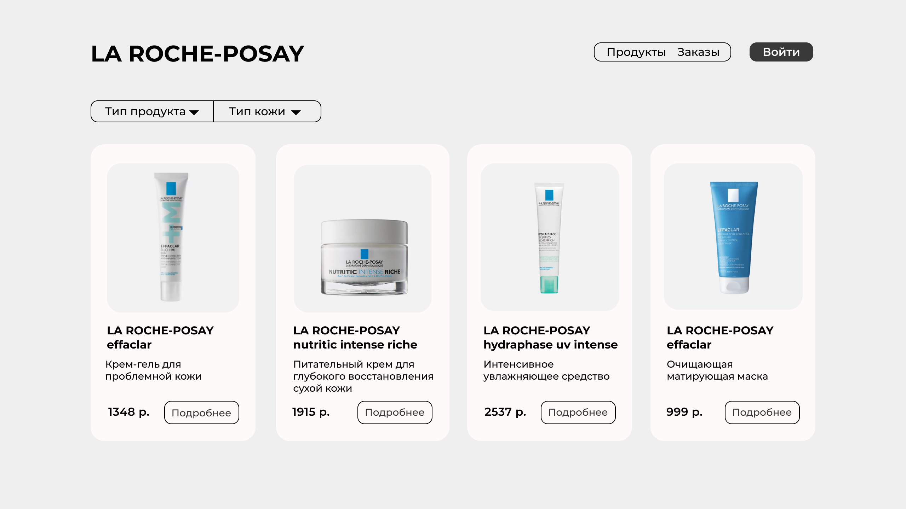

# Методические указания по созданию дизайна в Figma и верстке

<!-- ## План

1. [Начало работы с Figma](#начало работы с Figma)
2. [Создание карточки](#создание карточки)
3. [Страница подробного описания](#cтраница подробного описания)
4. HTML и CSS
5. Верстка карточки
6. Верстка страницы карточек
7. Верстка подробного описания


## Немного про SwiftUI
SwiftUI - это фреймворк для создания пользовательских интерфейсов на языке программирования Swift. Он был представлен Apple на -->

## Начало работы с Figma

Figma (Фигма) — это графический онлайн-редактор для совместной работы. Figma используют в основном для создания прототипов сайтов и приложений.
С фигмой можно работать с помощью [сайта](https://www.figma.com/) и [десктопного приложения](https://www.figma.com/downloads/) (после нажатия на "Desktop app for macOS" или "Desktop app for Windows"). Далее необходимо войти в аккаунт или зарегистрироваться.

После авторизации открывается главная страница, на которой в центре отображаются проекты, слева панель для перехода к недавним проектам, черновикам, избранными и проектами комманд (можно создавать команды и вместе создавать и работать над общими проектами).


Для создания проекта на левой панели нажимаем Drafts, затем на верхней панели Design file
Интерфейс можно разделить на 4 области:
1. Слева - слои
2. В центре - рабочее пространство
3. Справа - редактирование свойств объектов
4. Сверху - инструменты 


## Создание карточки
Карточка будет отображать картинку, название, краткое описание и кнопку для перехода к странице подробного описания продукта.
Необходимы - 2 прямоугольника, картинка, 3 текстовых блока.

Для создания прмоугольника надо выбрать его в панеле инструментов или нажать клавишу R, в рабочей области удерживая левую кнопку мыши создать прямоугольник произвольного размера.
Во вкладке с прямоугольником можно выбрать линию, стрелку, эллипс, многоугольник, звезду и изображение
<video src="assets/квадрат.mp4">
Создайте еще один прямоугольник, добавьте изображение и два текстовых элемента

<!-- Карточка:
- скругление: 20px
- цвет:

Картинка:
- скругление: 20px
- расположение: по центру

Название:
- шрифт: Montserrat
- размер: 16px

Описание, текст кнопки:
- шрифт: Montserrat
- размер: 16px

Кнопка
- скругление: 10px
- размер: 16px -->


## Страница подробного описания

Сделаем картинку и описание на отдельных блоках

## HTML и CSS

HTML - язык разметки гипертекста. Включает теги
С помощью html мы создаем элементы, а с помощью css - задаем им свойства

CSS - 

## Верстка страницы с карточками



Сначала создадим разметку, а потом будем прописывать свойства
Создаем файл index.html и style.css, в index.html пишем

```html
<!DOCTYPE html>
<!--  -->
<html lang="rus">
  <head>
    <meta charset="UTF-8" />
    <meta http-equiv="X-UA-Compatible" content="IE=edge" />
    <meta name="viewport" content="width=device-width, initial-scale=1.0" />
    <title>Магазин</title>
    <link rel="stylesheet" href="style.css" />
  </head>
  <body>
    <div class="space">
        <div class="header"></div>
        <div class="container"></div>
    </div>
  </body>
</html>
```
<!-- надо добавить описание каждой строки -->
Внутри body создадим div с именем space, внутри которого будем располагать наши элементы
Страница разделена на две части: хедер и контейнер
В хедере будет название компании, навигационная панель
В контейнере будут карточки

Файл style.css
```css
@import url('https://fonts.googleapis.com/css2?family=Montserrat&display=swap');
*{
    margin: 0;
    padding: 0;
    box-sizing: border-box;
    font-family: 'Montserrat', sans-serif;
    color: #000000; 
}
body{
    background: #EFEFEF;
}
.space{
    width: 80%;
    margin-left: auto;
    margin-right: auto;
}
```

На [сайте]() выбираете понравившийся Cyrrylic шрифт 
<!-- ну и что-то еще -->
Копируем import 

background - цвет фона элементы 
width - ширина
margin-left - расстояние слева
margin-right - расстояние справа

Единицы измерения в css
<!-- добавить -->

## Верстка карточки

Добавим это внутрь класса container
```html
<div class="card">
    
    <p class="title">LA ROCHE-POSAY effaclar</p>
    <p class="short-description">Крем-гель для проблемной кожи</p>
    <p>1348 ₽</p>
    <a href="./detail.html" class="card-button">Подробнее</a>
</div>
```
<!-- описание карточки -->

Сделаем карточку красивой

```css
.card{
    border-radius: 20px;
    background: #FFFAFA;
    padding: 10%;
    display: flex;
    flex-direction: column;
    justify-content: space-between;
}
```
border-radius - скругление
display - 
flex-direction: column - расположение элементов в столбик внутри блока 
justify-content - расположение элементов относительно друг друга

Стили для картинки
```css
.image{
    width: 100%;
    height: 211px;
    border-radius: 20px;
    object-fit: cover;
}
```
Картинка будет занимать 100% доступной ей ширины, так как у карточки padding - 10%, то картника будет заполнять в ширину 80% карточки и располагаться по центру

Посмотрим высоту картчоки и скругление в фигме
<!-- картинка из фигмы -->
object-fit: cover - 

```css
.title{
    margin-top: 15px;
    font-size: 16px;
    font-weight: bold;
}
```

```html
<div class="card">
    <div class="info">
        
        <p class="title">LA ROCHE-POSAY nutritic intense riche</p>
        <p class="short-description">Питательный крем для глубокого восстановления сухой кожи</p>
    </div>
    <div class="down">
        <p>1915 ₽</p>
        <a href="" class="card-button">Подробнее</a>
    </div>
</div>
```

## Верстка подробного описания


