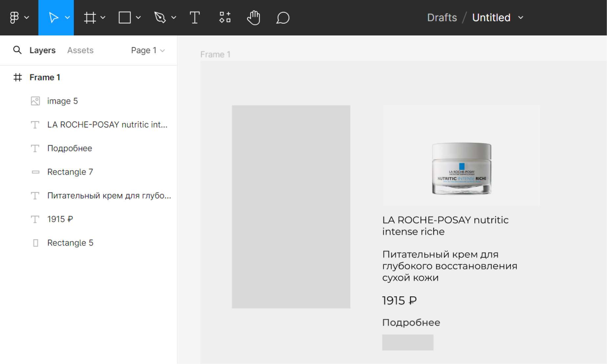

# Методические указания по созданию дизайна в Figma и верстке

<!-- ## План
1. [Начало работы с Figma](#начало работы с Figma)
2. [Создание карточки](#создание карточки)
3. [Страница подробного описания](#cтраница подробного описания)
4. HTML и CSS
5. Верстка карточки
6. Верстка страницы карточек
7. Верстка подробного описания
-->

## Начало работы с Figma

Figma (Фигма) — это графический онлайн-редактор для совместной работы. Figma используют в основном для создания прототипов сайтов и приложений.
С фигмой можно работать с помощью [сайта](https://www.figma.com/) и [десктопного приложения](https://www.figma.com/downloads/) (после нажатия на "Desktop app for macOS" или "Desktop app for Windows"). Далее необходимо войти в аккаунт или зарегистрироваться.

После авторизации открывается главная страница, на которой в центре отображаются проекты, слева панель для перехода к недавним проектам, черновикам, избранными и проектами комманд (можно создавать команды и вместе создавать и работать над общими проектами).


Для создания проекта на левой панели нажимаем Drafts, затем на верхней панели Design file
Интерфейс можно разделить на 4 области:
1. Слева - слои
2. В центре - рабочее пространство
3. Справа - редактирование свойств объектов
4. Сверху - инструменты 


## Создание страницы карточек
Создаем фрейм — основной элемент дизайна в Фигме. Это законченный документ, который может быть страницей сайта или экраном мобильного приложения. Фрейм объединяет объекты внутри себя.


Добавим странице цвет, нажимаем на фрейм, в правой панели находим вкладку Fill - она отвечает за заливку, нажимаем на квадратик. Ползунок позволяет выбрать цвет или можно ввести код цвета.


Остальные элементы добавим потом

## Создание карточки
Карточка будет отображать картинку, название, краткое описание, цену и кнопку для перехода к странице подробного описания продукта.
Необходимы - 2 прямоугольника, картинка, 3 текстовых блока.

Для создания прмоугольника надо выбрать его в панеле инструментов или нажать клавишу R, в рабочей области удерживая левую кнопку мыши создать прямоугольник произвольного размера.
Во вкладке с прямоугольником можно выбрать линию, стрелку, эллипс, многоугольник, звезду и изображение


Создадим еще один прямоугольник, добавим изображение и текстовые элементы. Когда мы создаем внутри фрейма элементы, они автоматически в панели слоев создаются внтури этого фрейма


### Свойства элементов
Свойства элементов настраиваются в правой панели

Свойства текста:
1. Шрифт. Выбрать шрифт можно на сайтее [Google Fonts](https://fonts.google.com/). Нажимаем на Filters->Language. Выбираем Cyrillic, чтоб выбрать шрифт, поддерживающий русский язык.

2. Стиль - у краткого описания и кнопки пусть будет Medium, у названия и цены - SemiBold
3. Размер - на сайтах для обычного текста имеют размер 14px, сделаем для краткого описания и кнопки так же, а название и цену размера 16px, чтоб они выделялись

Выбираем текстовый элемент, во вкладке Text нажимаем на название шрифта, находим необходимый шрифт, ниже устанавливаем стиль и размер шрифта. Если нажать на три точки, то откроется со всеми настройками шрифта


Аналогично сделаем для других текстовых элементов.


Свойства геометрических элементов:
1. Цвет. Это уже умеем делать
2. Скругление углов.
Рассмотрим параметры этой вкладки: X, Y - координаты элемента внтури фрейма, W, H - ширина и высота, пиктограмма угла - угол поворота элемента, скругление углов
Сделаем скругление у карточки и изображения 20px, а у кнопки 10px

3. Обводка. У кнопки сделаем обводку, а заливку уберем.
Для этого в Stroke нажмем на "+", добавится обводка. У нее можно настроить цвет, толщину, стороны, для которых их добавить. В Fill нажмем на "-" у цвета

Свойства изображения:
Для изменения размера нужно потянуть за границы изображения, при этом для пропорционального изменения сторон необходимо зажимать Shift.
Если вам необходимо обрезать картинку, перейдите во вкладку Fill и нажмите на изображение. В открывшемся окне над изображением есть выпадающий список, в нем надо выбрать Crop и менять границы. Если вы хотите заменить картинку, наведите на картинку в этом окне, появится кнопка "Choose image"


### Компановка карточки и Auto Layout
Мы подготовили все элементы, теперь скомпануем их.
Для начала сгруппируем кнопку. Выбираем с нажатой клавишей Shift прямоугольник и текст для кнопки, в правой панели в самой первой вкладке можно настраивать выравнивание, нам надо выровнять элементы относительно друг друга по вертикали и горизонтали, нажимаем на 2 и 5 значки, затем нажмите Ctrl+G (группировка элементов)

https://github.com/ssofiica/Design-tutorial/assets/91909561/60044485-36dd-43af-821f-07cb02d2d0b8

Теперь собираем карточку, переносим элементы на прямоугольник, являющийся фоном карточки, выравниваем элементы, располагаем цену и кнопку на одном уровне и группируем. Если несколько элементов сгруппированы, то при одном клике на элемент, будет выделена вся группа, поэтому надо два раза кликнуть по элементу, чтоб выделить именно его.

В фигме есть такой инструмент, как Auto Layout. Это позволяет создавать контейнеры, которые могут содержать другие элементы интерфейса, затем можно настроить правила расположения, такие как выравнивание или расстояние между элементами. Auto layout можно сравнить с flex в css.
Выделяем все элементы карточки, включая ее фон, в правой панели находим вкладку Auto layout, нажимаем плюс.


Выбираем вертикально расположение, внутренний отступ (padding) 20px, интервал между элементами 10px. 
Копируем карточку, меняем содержимое.
Итог:


## Страница подробного описания

Сделаем картинку и описание на отдельных блоках

## HTML

HTML - это язык разметки, используемый для определения структуры веб-страниц, посещаемых пользователями.
HTML состоит из ряда элементов, которые вы используете для того, чтобы охватить, обернуть или разметить различные части содержимого, чтобы оно имело определённый вид или срабатывало определённым способом.

Элемент = открывающий тег + содержимое + закрывающий тег
<p>Hello world!</p>

Открывающий тег: состоит из названия (обозначения) тега, помещённого внутри угловых скобок. Данный тег служит признаком начала элемента, с этого момента тег начинает влиять на следующее после него содержимое
Закрывающий тег: выглядит как и открывающий, но содержит слеш перед названием тега
Содержимое: включает текст или другие элементы

Рассмотрим теги, которые нам необходимы:
- ```<div>..</div>```. Cлужит для структуризации контента на веб-странице, для заключения содержимого в отдельные блоки. div создает блок, который по умолчанию растягивается по всей ширине браузера, а следующий после div элемент переносится на новую строку.
- ```<p>..</p>```. Представляет собой абзац, как блоки текста, отделенные от соседних блоков пустыми строками и/или отступами первой строки.
- ```<h1-6>..</h1-6>```. Представляют шесть уровней заголовков разделов. ```<h1>``` - это самый высокий уровень раздела, а ```<h6>``` - самый низкий. По умолчанию все элементы заголовка начинатся с новой строки и занимают всю ширину, доступную в содержащем их блоке.
- ``````. Добавляет изображение. Атрибут src обязателен и содержит путь к изображению (как путь до файла, так и ссылка на изображение в интернете), которое вы хотите вставить, атрибут alt содержит текстовую замену изображения.  Поисковые системы по текстовой замене могут индексировать изображение, а при проблемах с выводом изображения, браузер показывает текстовую замену. Существует большое колчество атрибутов для настройки изображения, но это можно сделать и через css.
Пример: ``````
- ```<a>..</a>```. Используется с атрибутом href и создает гиперссылку на веб-страницы, файлы, адреса электронной почты, местоположения на той же странице или на что-либо еще, к чему может быть обращен URL.

Больше информации про [теги](https://developer.mozilla.org/en-US/docs/Web/HTML/Element/).

Будучи «чистым» контейнером, ```<div>``` элемент по своей сути ничего не представляет. Вместо этого он используется для группировки содержимого, чтобы его можно было легко стилизовать с помощью атрибутов class или id

## CSS

CSS (Cascading Style Sheets) - это язык таблиц стилей, язык описания внешнего вида веб-страницы.
С помощью html мы создаем элементы, а с помощью css - задаем им свойства.
Предположим, что мы создали разметку с помощью html. Теперь мы хотим сделать красивый вншений вид страницы, поэтому нам надо описать, как должен выглядеть каждый элемент. Для этого надо описать набор правил форматирования элемента или просто стиль.

Набор правил = селектор {свойство: значение;}
```css
div {
    background: #EFEFEF;
}
```
Селектор - имя элемента, которому будет присвоен стиль
Свойство - то, что хотим поменять
Значение - одно из возможных проявлений свойства

### Селекторы
| Тип селектора | css                             | html                          | Устанавливает правила для                                                            |
|---------------|---------------------------------|-------------------------------|--------------------------------------------------------------------------------------|
| Тег           | p {<br> color: #ffffff;<br> }      | ```<p>```                                 | Всех тегов p                                                                                          |
| Идентификатор | #my-id {<br>color: #ffffff;<br> } | ```<p id="my-id">```                      | Элемента с данным  идентификатором. На странице каждое значение идентификатора должно быть уникальным |
| Класс         | .title {<br>color: #ffffff;<br> } | ```<p class="title> <h3 class="title">``` | Для всех элементов с указанным классом. На странице может быть несколько экземпляров класса           |
| Псевдокласс   | p:hover {<br>color: #252525;<br> } | ```<p>```                              | Указанного элемента в указанном состоянии. В этом примере ```<p>``` меняет цвет на при наведении мыши       |

### Свойства

Свойств и их значений огромное количество, рассмотрим маленькую их часть, без которых не обойтись, остальное изучайте по мере необходимости.

**Размеры и расстояния**

width - определяет ширину элемента. Может быть указана в пикселях(px), процентах(%), em, rem, vw, vh (о них ниже)
height - определяет высоту элемента
border - рамка вокруг элемента. Можно настроить толщину, стиль рамки и цвет. Например, border: 1px solid black;
border-radius - скругление краев в пикселях или процентах относительно элемента
margin - размер внешнего отступа вокруг элемента, указывается в px, %, auto и др. 
padding - размер внутреннего отступа, указывается в px, %, auto и др. 

Как указать margin и padding?
1. постфиксы: top, right, left, bottom. Примерs: { margin-top: 10px; padding-left: 2%; }
2. количество значений. 
- { margin: 1px; } - отступ в 1px со всех сторон
- { margin: 1px 5px; } - первое значение для верхнего и нижнего отступов, второе для левого и правого отступов
- { margin: 1px 5px auto; } - первое значение для верхнего отступа, второе - левого и правого, третье - нижнего
- { margin: 1px 5px auto 0; } - по часовой стрелке для каждой из сторон: сверху, справа, снизу и слева.

**Разметка**

display - отображение элементов. block - элемент начинается с новой строки и занимает всю ширину контейнера, inline - элемент располагается внутри родительского элемента и не занимает отдельную строку, none - элемент не отображается, grid - элемент отображается в виде сетки, flex - гибкий контейнер

display: flex <br>
Основная идея — гибкое распределение места между элементами, гибкая расстановка, выравнивание, гибкое управлени

Свойства, которые используются вместе с flex:
justify-content
flex-direction
align-items

display: grid<br>

**Текст и цвет**
background-color
color
font-size
font-weight
text-align

**Изображения**
background-image
object-fit

em — это единица измерения, равная размеру шрифта родительского элемента. Если у родителя размер шрифта равен 16px, то 1em будет равен 16px. Это полезно, когда нужно, чтобы элемент изменялся вместе с размером шрифта родителя <br>
rem — это тоже единица измерения, но она равна размеру шрифта корневого элемента (html). Это полезно для тех элементов, которые должны быть привязаны к размеру шрифта html, а не к размеру шрифта конкретного родителя <br>
vw и vh используются для задания размеров в процентах от ширины или высоты окна браузера. Они полезны для создания адаптивных дизайнов, которые подстраиваются под разные размеры экранов. 1vw равен 1% от ширины окна браузера, а 1vh равен 1% от высоты окна<br>

## Верстка страницы с карточками


Сначала создадим разметку, а потом будем прописывать свойства
Создаем файл index.html и style.css, в index.html пишем

```html
<!DOCTYPE html>
<!--  -->
<html lang="rus">
  <head>
    <meta charset="UTF-8" />
    <meta http-equiv="X-UA-Compatible" content="IE=edge" />
    <meta name="viewport" content="width=device-width, initial-scale=1.0" />
    <title>Магазин</title>
    <link rel="stylesheet" href="style.css" />
  </head>
  <body>
    <div class="space">
        <div class="header"></div>
        <div class="container"></div>
    </div>
  </body>
</html>
```
<!-- надо добавить описание каждой строки -->
Внутри body создадим div с именем space, внутри которого будем располагать наши элементы
Страница разделена на две части: хедер и контейнер
В хедере будет название компании, навигационная панель
В контейнере будут карточки

Файл style.css
```css
@import url('https://fonts.googleapis.com/css2?family=Montserrat&display=swap');
*{
    margin: 0;
    padding: 0;
    box-sizing: border-box;
    font-family: 'Montserrat', sans-serif;
    color: #000000; 
}
body{
    background: #EFEFEF;
}
.space{
    width: 80%;
    margin-left: auto;
    margin-right: auto;
}
```

На [сайте]() выбираете понравившийся Cyrrylic шрифт 
<!-- ну и что-то еще -->
Копируем import 

background - цвет фона элементы 
width - ширина
margin-left - расстояние слева
margin-right - расстояние справа

Единицы измерения в css
<!-- добавить -->

## Верстка карточки

Добавим это внутрь класса container
```html
<div class="card">
    
    <p class="title">LA ROCHE-POSAY effaclar</p>
    <p class="short-description">Крем-гель для проблемной кожи</p>
    <p>1348 ₽</p>
    <a href="./detail.html" class="card-button">Подробнее</a>
</div>
```
<!-- описание карточки -->

Сделаем карточку красивой

```css
.card{
    border-radius: 20px;
    background: #FFFAFA;
    padding: 10%;
    display: flex;
    flex-direction: column;
    justify-content: space-between;
}
```
border-radius - скругление
display - 
flex-direction: column - расположение элементов в столбик внутри блока 
justify-content - расположение элементов относительно друг друга

Стили для картинки
```css
.image{
    width: 100%;
    height: 211px;
    border-radius: 20px;
    object-fit: cover;
}
```
Картинка будет занимать 100% доступной ей ширины, так как у карточки padding - 10%, то картника будет заполнять в ширину 80% карточки и располагаться по центру

Посмотрим высоту картчоки и скругление в фигме
<!-- картинка из фигмы -->
object-fit: cover - 

```css
.title{
    margin-top: 15px;
    font-size: 16px;
    font-weight: bold;
}
```

```html
<div class="card">
    <div class="info">
        
        <p class="title">LA ROCHE-POSAY nutritic intense riche</p>
        <p class="short-description">Питательный крем для глубокого восстановления сухой кожи</p>
    </div>
    <div class="down">
        <p>1915 ₽</p>
        <a href="" class="card-button">Подробнее</a>
    </div>
</div>
```

## Верстка подробного описания


